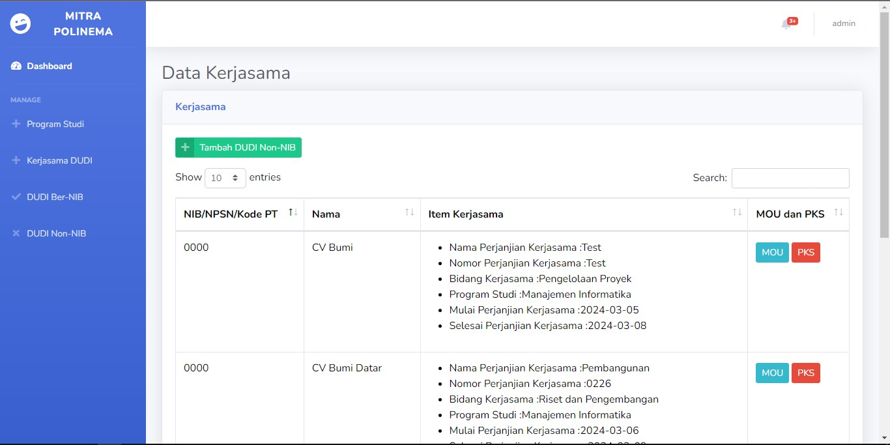

## Screenshot 





## Teknologi Yang Digunakan 

Framework : Laravel, Boostrap

Database : Mysql

## Prasyarat

Pastikan Anda telah menginstal [Laravel](https://laravel.com/) dan [Composer](https://getcomposer.org/) di sistem Anda sebelum menjalankan proyek ini.

## Instalasi

1. Clone repositori ini:

   ```bash
   git clone https://github.com/faisal-gif/website_sig.git
   ```
   
2. Masuk ke direktori proyek:

   ```bash
   cd website_sig
   ```

3. Salin file .env.example menjadi .env dan sesuaikan pengaturan database:

   ```bash
   cp .env.example .env
   ```

4. Jalankan perintah berikut untuk menginstal dependensi:

   ```bash
   composer install
   ```

5. Install dependensi JavaScript menggunakan npm:

   ```bash
   npm install
   ```

6. Generate key aplikasi Laravel:

   ```bash
   php artisan key:generate
   ```

7. Migrasi dan isi database dengan perintah berikut:

   ```bash
   php artisan migrate --seed
   ```

7. Migrasi dan isi database dengan perintah berikut:

   ```bash
   php artisan laravolt:indonesia:seed
   ```  

8. Jalankan server pengembangan Laravel

   ```bash
   php artisan serve
   ```
